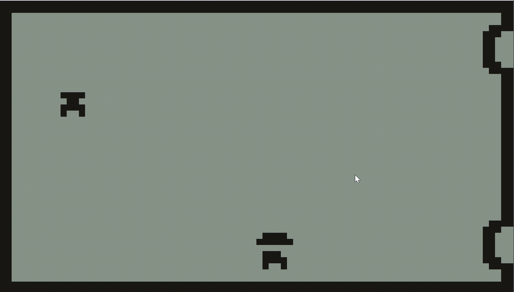

Screen width is 84x48 scaled to 1680x960

all assets here are 6x6. 
At first they were 8x8 but then i realized 84 is not divisable by 8 and I couldn't fit the 
walls on the screen correctly. 

Walls look a little big? Might try 4x4
4x4 is not a lot of room to make a character :)

